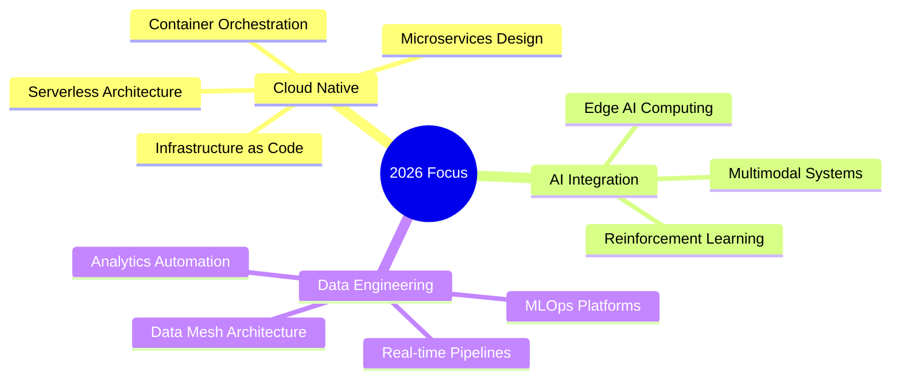

  

  

  
  

---

### 🚀 About Me
I am a **Lead Platform Engineer** and **Cloud Native Architect** focused on the intersection of **DevOps and Agentic AI**. I build **self-healing infrastructure** and **share the journey** with the global engineering community.

* 🔭 **Current Project:** Building an `Autonomous SRE Crew` using `CrewAI and Ollama.` I’m implementing `event-driven AI agents` that can automatically debug `Kubernetes clusters` and resolve incidents before they reach a human.
* 🎥 **YouTube Content:** I `simplify complex architectures` from setting up `High-Availability Kubernetes clusters` with Kubespray to building production-ready GitOps pipelines with ArgoCD.
* ⚙️ **Tech Stack:** Specialized in `Platform Engineering` (K8s, Terraform, OpenShift) and `AI-Driven Operations` (LLMs, K8sGPT, Agentic Frameworks).
* 💬 **Let's Talk:** Ask me about building `Local LLM workflows` for `infrastructure or optimizing` MTU/Networking in CNI plugins like Calico.

---

### 📺 Latest Technical Deep Dives

---

### 🌟 Popular Technical Deep Dives
> [!IMPORTANT]
> Check out my top-rated guides on Platform Engineering and AI.

  <a href="https://www.youtube.com/channel/UCrScDsPZSceXgZOLJGrOOIw"><b>View All Tutorials →</b></a>

---

### 🛠️ Tech Stack & Tooling
| Category | Tools |
| :--- | :--- |
| **Cloud & Orchestration** |      |
| **CI/CD & GitOps** |      |
| **Development & AI** |     |
---

## GitHub Analytics

  

<table>
<tr>
<td align="center">
  
</td>
<td align="center">
  
</td>
<td align="center">
  
</td>
</tr>
</table>

---
### Strategic Development Areas

---

### 📬 Let's Connect

  
  
  
  
  

  <i>Automated with ❤️ using GitHub Actions</i>

